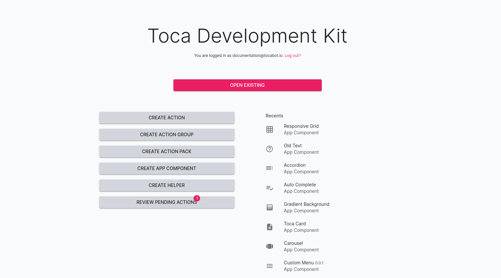

# Introduction

Welcome to the Toca Development Kit (TDK).

The TDK allows users to extend the capabilities and features available on a Toca platform.

Access the TDK by prefixing the Toca platform URL with `ui-tdk`. For example, if the toca platform URL is `https://trial.toca.cloud` then the TDK associated with this platform can be reached at `https://ui-tdk.trial.toca.cloud`.

