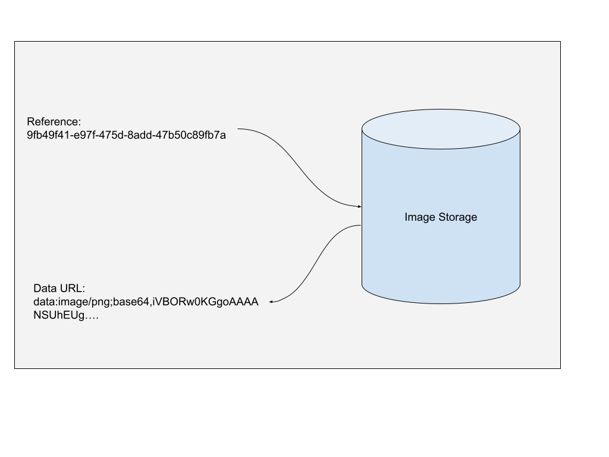

# Image

## Definition

An `Image` type is a pointer to an image which is stored elsewhere in the system. An `Image` is simply a string and is either a data url containing a base64 encoded image or it's the pointer to the image.

When an image is used as an input to an action, the value the action stores is the pointer (which is a `uuid v4`), when you come to use the image in an action though, this has been dereferenced to the base64 image already.



An image is stored as an instance of the `Document` class which is defined as the following:
```csharp
public class Document
{
    public string Id { get; set; }
    public string DocumentId { get; set; } // The pointer
    public string Version { get; set; }
    public string AssociatedUserId { get; set; }
    public string Name { get; set; }
    public string Content { get; set; } // The base64 data url
    public string Format { get; set; }
    public StorageType StorageType { get; set; }
}
```

## Methods
As an Image type is simply a string, the same methods are available as with a string.

```csharp
var image = "data:image/png;base64,iV...";
AddDebugLog($"Image length is {image.Length}");
```
